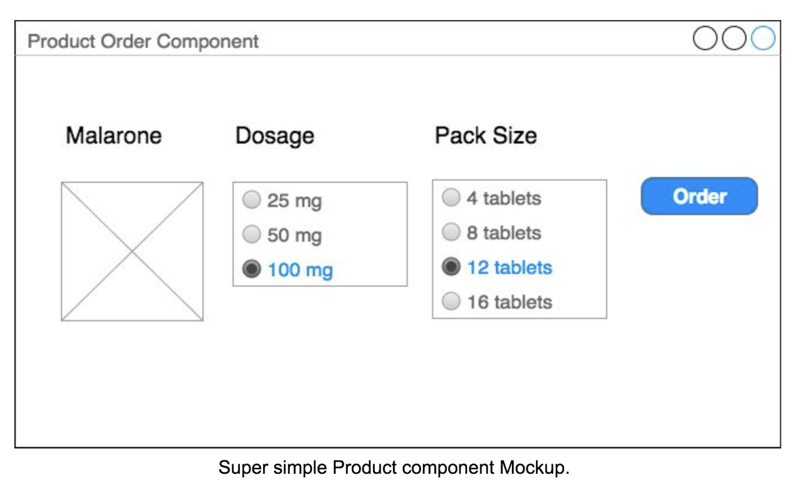
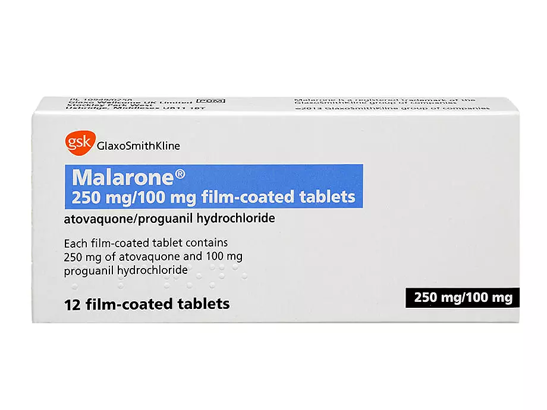

# Pair Programming Exercise

Please create a page with a list of Product components.

You can use whatever frontend framework you like to do the exercise.

Each Product component should contain:
- Product Image
- A dosage selection control
- Pack size selection control
- An order button

Once the user selects the desired dosage and pack size then when clicking the order button
please alert or render a summary (name, dosage and pack size selected) of the relevant
order.



Media:



### Nice to have
- Explain approach for testing
- Implement minimum unit-tests

## Need a backend?

Build an API that will give you the data in JSON format for the page you just built. For example, you could build something that looks like:

Request:

```
GET /products
```

Response:

```
{
    "products": [{
        "name": "Malarone",
        "image": "https://github.com/healthbridgeltd/pair-programming-exercises/raw/master/frontend/byof/malarone.webp",
        "dosages": [
            {
                "dosage": "25 mg",
                "sizes": [
                    "4 tablets",
                    "8 tablets",
                    "12 tablets",
                    "16 tablets",
                ],
            },
            {
                "dosage": "50 mg",
                "sizes": [
                    "4 tablets",
                    "8 tablets",
                    "12 tablets",
                ],
            },
            {
                "dosage": "100 mg",
                "sizes": [
                    "8 tablets",
                    "16 tablets",
                ],
            }
        ]
    }]
}
```

### Nice to have

- Build an endpoint to store the order
- Error handling
- Logging of errors
- Unit tests

If you had more time, what would you improve of your solution? Elaborate why.
